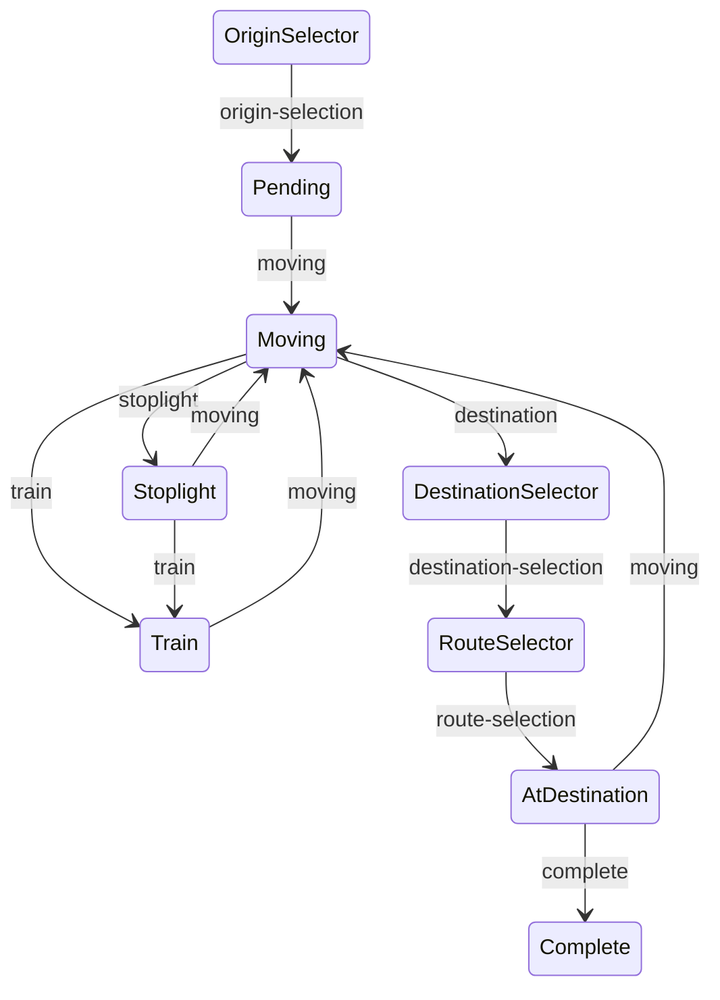

# Daycare Dropoff Tracker
___
This app is meant to track the amount of time spent going to and from daycare
with my kids, including which route was taken, when the trip started, the total trip
duration and how long was spent stopped at stoplights, the train and dropoff.

It should be able to function with limited connectivity and intermittent crashes. IE if
the app crashes mid-trip, when reopened there should be a good chance that the app
picks up exactly where it left off. It is meant as a data capture tool, and not so much
an analysis tool - though it may someday evolve into the latter.

## Basic App Flow
1. On app launch, checks to see if there is a trip in progress.
2. If there is a trip, it loads the trip in its appropriate state
3. If there is no trip in progress, it shows the un-started state
4. 

## Question to answer
1. SQLite Integration Test
2. What happens when an insert fails
3. What happens when an update fails

## TODO
1. Add a way to delete a trip, probably a soft delete through a new column on trip table
2. Add a way to edit location names
3. Add a way to edit route names
4. Add a way to examine what routes show up for what location combinations
5. Add a way to delete routes? Maybe this just makes it so that the route isn't an option in the future?

